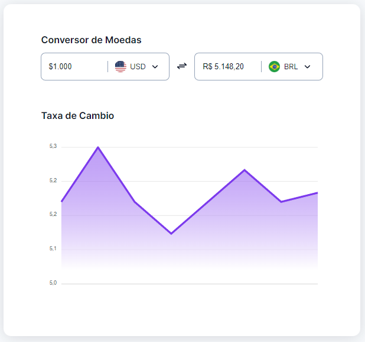

<h1 align="center"> boraCodar 09 - Conversor de moedas </h1>

  <a href="#-tecnologias">Tecnologias</a>&nbsp;&nbsp;&nbsp;|&nbsp;&nbsp;&nbsp;
  <a href="#-projeto">Projeto</a>&nbsp;&nbsp;&nbsp;&nbsp;&nbsp;

  

## 🚀 Tecnologias

Este projeto foi desenvolvido com as seguintes tecnologias:

- HTML
- CSS
- JavaScrit
- [ApexCharts](https://apexcharts.com/)

## 💻 Projeto

O objetivo dessa série é apenas fazer o layout e com isso eu pude reproduzir toda a parte visual proposta e praticar meus conhecimentos em CSS, claro que fazer a parte funcional é importe e será feita. Mas o proposto foi realizado!!
